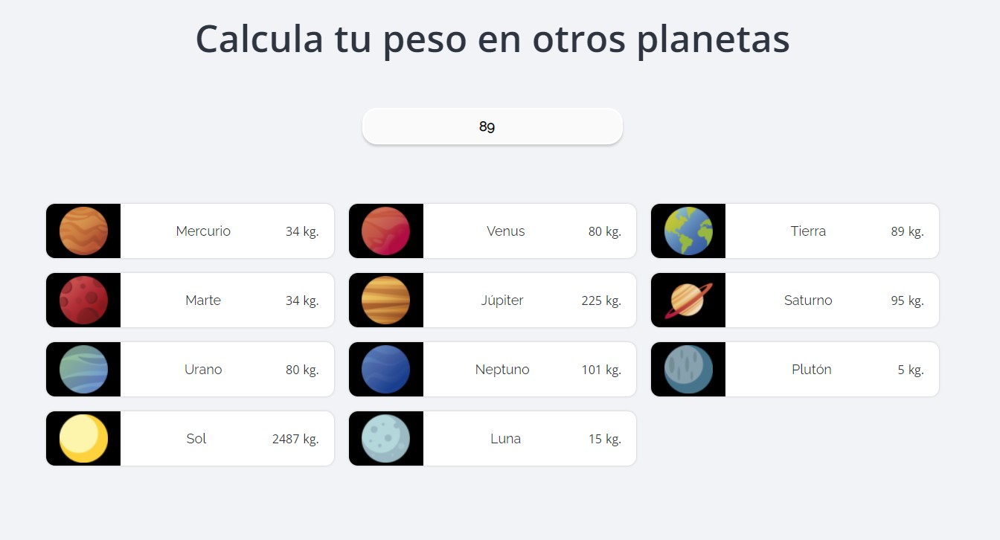

# Calcula tu peso en otros planetas

## Proyecto con HTML, CSS y JS



### Proyecto que calcula el peso ingresado de acuerdo a la gravedad de los diferentes planetas del sistema solar.

---

## Fórmula para calcular el resultado

```
 ( número_ingresado * fuerza_de_gravedad ) / gravedad_tierra
```
